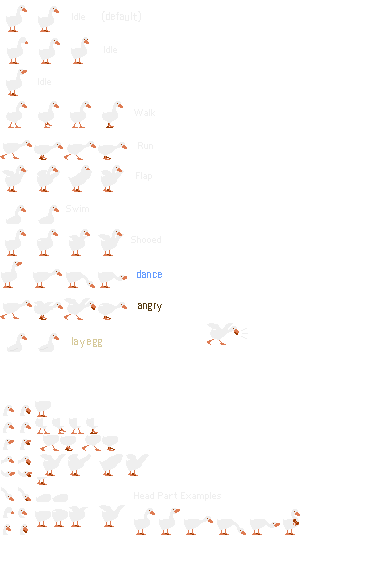

# Annoying Goose Browser Extension

A playful goose that encourages taking breaks. This extension is designed to prevent users from getting too absorbed with their devices by providing a fun way to take breaks.

BEWARE THE WRATH OF THE GOOSE! 🪿
Use at your own risk. You may get very annoyed.

## Plans

- Add a settings button within popup specifying the "evilness level" of the goose.
  - The higher the evilness level, the more "crazy" the goose's pranks will be (i.e. ability to close tabs and other destructive actions).

## Goose State Diagram

## Acknowledgements

Credit to Sonicfan32 for the base goose sprites!
