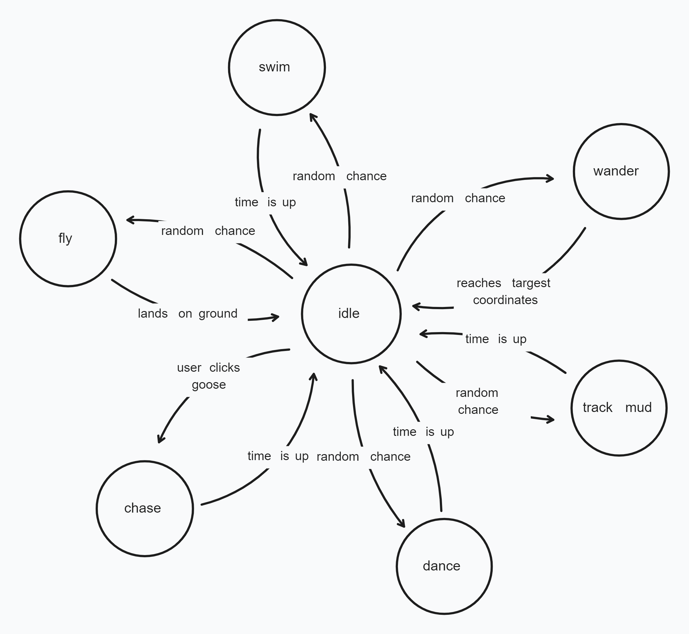

# Annoying Goose Browser Extension

BEWARE THE WRATH OF THE GOOSE! 🪿

- Download on the [Chrome web store](https://chromewebstore.google.com/detail/annoying-goose/eejfnccgoejgidifcgpphjjfodmiofkm)
- Download on the [Firefox add-ons store](https://addons.mozilla.org/en-US/firefox/addon/annoying-goose/)

## Description

A pixel art goose that wanders around your screen and does random stuff. You could use it to prank your friends, or keep it around as a little browser buddy :D

### 📋 HOW TO USE

1. Open a new tab (cannot be a blank tab)
2. Find Annoying Goose in your extensions list, then click it and select "Start Goose".

- To disable the goose select "VAPORIZE GOOSE" from the extension.
- To open a popup allowing you to manually change the goose's current activity, select "Enable State Swapper" from the extension.

### 📅 VERSION HISTORY

=== Version 1.5 ===

- Punch sound effect when goose is clicked.
- Added the goose's "lay egg" state (still contains bugs).

=== Version 1.4 ===

- Made the goose block HTML elements it is currently on top of. This prevents the user from accidently clicking something else while trying to interact with the goose.
- Fixed a bug where the goose would occasionally glitch out after stepping out of mud.
- Made all music and sound effects pause when the user leaves the active tab.
- Added a "buy me a coffee" button to the main extension popup :)

=== Version 1.3 ===

- Fixed a bug where the mouse could be held down to hit the goose multiple times.

=== Version 1.2 ===

- Added toggle button to enable/disable the Goose State Swapper pop-up.

=== Version 1.1 ===

- Added the goose's "track mud" state.
- Added text boxes for the goose.
- Fixed movement bugs.

### 🎨 ARTWORK

- Credit to Sonicfan32 for the goose sprite sheet.
- Remaining sprites were created by me (Nathan)

## Plans

- New goose states:

- Volume slider in popup

- Minigame (will take a lot of time)
  - Whenever the goose is active, make a random chance for tickets (looks like a dollar bill with a goose face on it) to appear randomly on the screen. When clicked, add a ticket to user's OVERALL storage (not just the current tab).
  
  - In the extension popup, make a grayed out button that says "Play Minigame" with a ticket icon. When clicked, use up a ticket and open a new tab with the minigame where the user controls a goose with arrows keys in (1) a platformer style game to collect coins or (2) a flappy bird style game to avoid obstacles (with a coin counter going up for each obstacle avoided). The coins are the real currency and will be used for clothing items for the goose.

## Goose State Diagram

